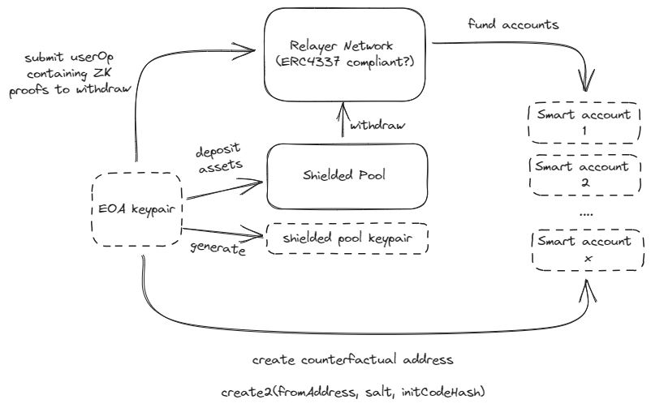

<p align="center"><h1 align="center">Private Accounts 🔒</h1></p>

## Mission

Private accounts for EVM chains.

## Disclaimer

This code is unaudited and under construction. This is experimental software and is provided on an "as is" and "as available" basis and may not work at all. 

### Prerequisites

- pnpm (8.2.0+)
- circom (2.1.5+)
- b2sum (8.3.2+)

### Install dependencies

```
pnpm install
```

### Run tests

```
pnpm test
```

- Run integration tests

### Build project

```
pnpm build
```

- Build circuit artifacts
- Bundle all keys encoded to json files

### Run wallet example

```
pnpm wallet
```

- run the wallet application

## Architectural Overview



The above diagram shows the current high level overview of the user flow, which will be constantly updated as new modules are being built out.
